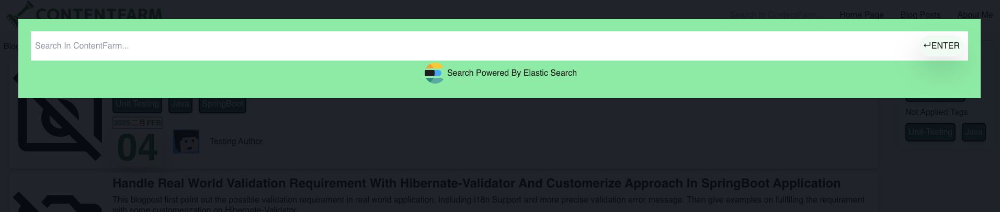

# Blog Web Next.js Repo
This is a [Next.js](https://nextjs.org) project bootstrapped with [`create-next-app`](https://nextjs.org/docs/app/api-reference/cli/create-next-app).
The project aim is to learn and practice `Next.js`, `Three.js` and `React Three Fiber`.
Besides, this project is served as the frontend part for my personal blog website, which the backend part can follow [`blogMicroService`](https://github.com/kenwu565657/blogMicroService).
[`https://github.com/kenwu565657/blogMicroService`](https://github.com/kenwu565657/blogMicroService).

## Getting Started
First, run the development server:
```bash
npm run dev
# or
yarn dev
# or
pnpm dev
# or
bun dev
```
Open [http://localhost:3000](http://localhost:3000) with your browser to see the result.
## Web Page Screen Shot And Feature Highlight
Below is some Screen Shot and Feature highlight of the website (i.e. need to start backend part too)
## 1. 3D Model Using R3F


## 2. Filter Blog Post By Tags


## 3. Search Blog Post By Keywords



## 4. User-Friendly Reading
### 4.1 Copy Code Block

### 4.2 Header Tracking Table Of Content


## 5. Responsive Design


